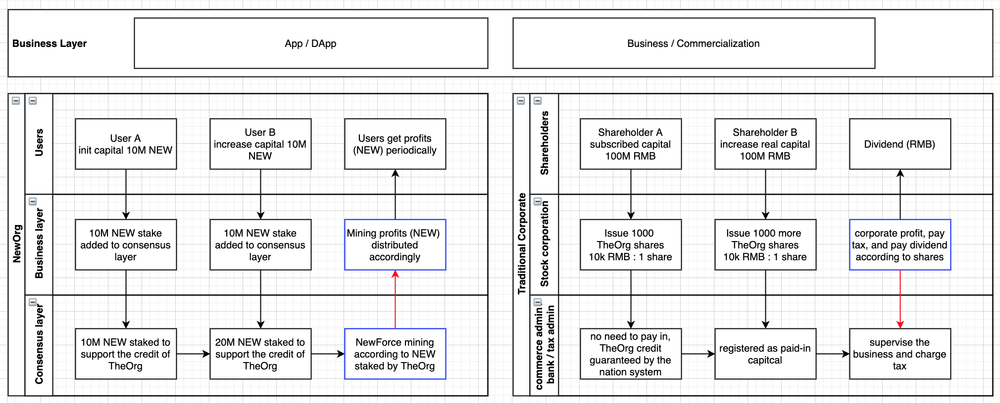
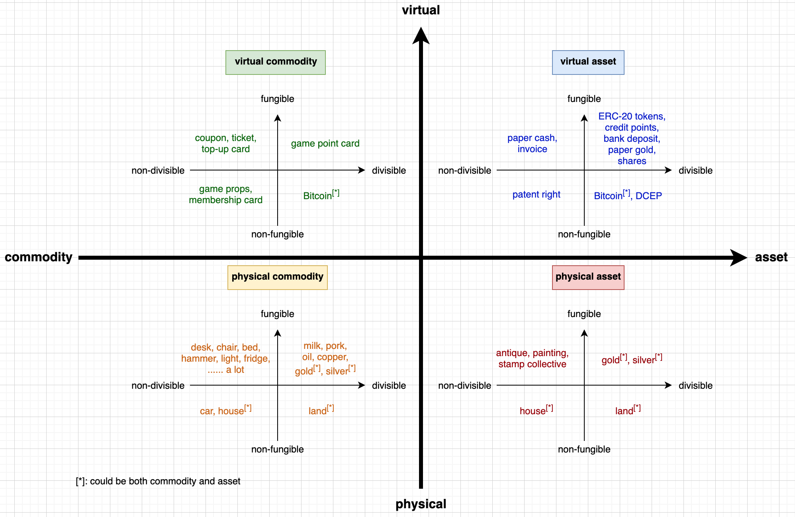

## Simple Summary

NewOrg template standard represents the living organization in newton ecosystem and a new DAO paradigm for the next generation social governance and collaboration.

## Abstract

NewOrg methods and standard based on NewChain and smart contract technologies are defined as is:
1. based on NewChain and its smart contract technologies.
2. to replace the traditional limited corporation with new governance paradigm based on blockchain technologies.
3. to define a set of meta rules for organization governance, and clarify the separation of these rules between NewChain layer and contract layer to implement: (1) business irrelative meta rules; (2) flexibility of neworg governance token; (3) anchoring all neworg to NewChain.
4. compatible with staking nodes as well as NewForce incentivization model in current NewPay for easier migration.
5. a complete open standard for any organization, institution, goverments to create NewOrg and transfer the centralized trust to the decentralized infrastructure and trust.

## Motivation

To replace the traditional limited corporation with new governance paradigm based on blockchain technologies, illustrated as below:



## Specification

### Meta Data

The meta data functions are constant methods that returns information. Parameters all have a leading _.

#### orgInfo

returns the informaiton of the Org:
- _name, the name of the Org 
- _type, the type of the Org
	* 1 - Commercial Instituation
	* 2 - Community Group
	* 3 - Government Sector
	* 4 - Non-profit Organization
	* 5 - Developer Community
- _description
- _countryRegion
- _url, the website of the Org
- _managementFee, %, ranging 0-100, of mining profits that would be attributed to the Org owner

```js
function orgInfo() public view returns (string _name, uint8 _type, string _description, string _contryRegion, string _url, uint8 _managementFee)
```

#### totalStaking

returns the total staking amount of NEW (unit: ISSAC) of the Org.

```js
function totalStaking() public view returns (uint256 _amount)
```

#### stakingAmountOf

returns the staking amount of a specific address which is a partner of the Org.

```js
function stakingAmountOf(address _partner) public view returns (uint256 _amount)
```

#### versionTag

returns the versionTag (e.g. "0.1.0") of the Org.

```js
function versionTag() public view returns (string _versionTag)
```

#### owner

returns the owner address of the Org.

```js
function owner() public view returns (address _owner)
```

#### countOfMember

returns the count of members of the Org.

```js
function countOfMember() public view returns (uint256 _count)
```

#### isMember

returns if the given address is the member of the Org.

```js
function isMember(address _person) returns (bool _isMember)
```

### Interaction / Functions

The interaction functions are methods that would change the states.

#### modifyOrgInfo

modifies the information of the Org (refer to orgInfo() above).

```js
function modifyOrgInfo(string _name, uint8 _type, string _description, string _contryRegion, string _url, uint8 _managementFee)
```

#### increaseStaking

increases the total staking amount for the caller itself.

```js
function increaseStaking() payable
```

#### increaseStakingFor

increases the staking amount for someone else.

```js
funciton increaseStakingFor(address _stakeholder) payable
```

#### decreaseStaking

decreases the staking amount of the caller.

```js
function decreaseStaking()
```

#### joinOrg

joins the Org (as the caller).

```js
function joinOrg()
```

#### exitOrg
exits the Org (as the caller).

```js
function exitOrg()
```

## Rationale


## Asset Token Matrix

Possible asset tokens could be formulated with the following Boston matrix:



## Test Cases
TBD

## Implementation
TBD

## TBD

Org token is removed from the original version and it should be considered later.

## References

* ERC-20 https://eips.ethereum.org/EIPS/eip-20 

## Copyright
Copyright and related rights waived via [CC0](https://creativecommons.org/publicdomain/zero/1.0/).

